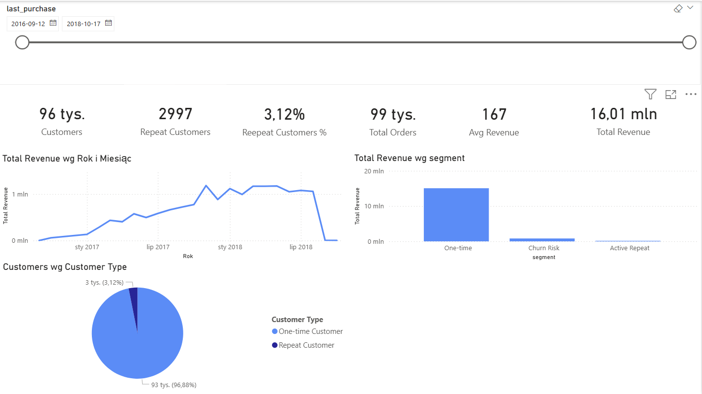

Olist E-commerce Customer Analysis

Project Overview

This project analyzes customer behavior using the Olist Brazilian E-commerce dataset.
The goal of the analysis was to explore the dataset, create customer-level metrics, segment customers based on purchasing behavior, and build a business dashboard.

Data exploration and preparation were performed in Python using Jupyter Notebook.
The processed datasets were later used to build a Power BI dashboard presenting key customer and revenue metrics.

---

Project Structure

project-1-ecommerce-analysis/

01_data/
└── processed/
        ├── customer_metrics.csv
        ├── retention_matrix.csv
        └── segment_summary.csv

02_notebooks/
├── 01_data_exploration.ipynb
└── 02_customer_segmentation.ipynb

03_dashboard/
└── olist_customer_analysis.pbix

04_Assets/
└── dashboard_preview.png

.gitignore
README.md

---

Dataset

This project uses the Olist Brazilian E-commerce public dataset.

Dataset source:
https://www.kaggle.com/datasets/olistbr/brazilian-ecommerce

Raw data files are not included in this repository.

After downloading the dataset from Kaggle, place the raw CSV files in:

01_data/raw/

The repository contains only processed datasets generated during the analysis.

---

Tech Stack

Python 3.11
pandas
numpy
matplotlib
seaborn
Jupyter Notebook
Power BI
Git
GitHub
PyCharm
Anaconda / Conda

---

Analysis Workflow

1. Download the raw Olist dataset from Kaggle
2. Load and explore the data in Jupyter Notebook
3. Perform exploratory data analysis (EDA)
4. Create customer-level metrics and segmentation
5. Export processed datasets
6. Build a Power BI dashboard

---

Tools and Workflow

Anaconda / Conda

- created an isolated Python environment
- managed project dependencies

PyCharm

- main development environment
- project and notebook management

Python & Jupyter Notebook

- data exploration
- customer metrics creation
- customer segmentation
- export of processed datasets

Generated datasets:

- customer_metrics.csv
- segment_summary.csv
- retention_matrix.csv

Power BI

- creation of the final business dashboard based on processed datasets

Git / GitHub

- version control
- project hosting

---

How to Run the Project

1. Clone the repository

git clone https://github.com/marekjuchnowicz2001-hue/project-1-ecommerce-analysis.git

2. Download the dataset

Download the dataset from Kaggle:
https://www.kaggle.com/datasets/olistbr/brazilian-ecommerce

3. Place raw data

Place the downloaded CSV files in:

01_data/raw/

4. Create the Conda environment

conda create -n ecommerce_analysis python=3.11

5. Activate the environment

conda activate ecommerce_analysis

6. Install required libraries

pip install pandas numpy matplotlib seaborn jupyter

7. Run the notebooks

Open and run the notebooks located in:

02_notebooks/

8. Open the dashboard

Open the Power BI file:

03_dashboard/olist_customer_analysis.pbix

---

Dashboard

The final dashboard was created in Power BI based on the processed datasets generated in Python.

The dashboard presents key customer and revenue metrics derived from the analysis.

Dashboard Preview

Author

Marek Juchnowicz
Data Analytics Student